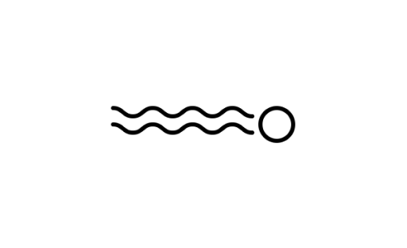

  

<h1 align="center">Photon 🚀</h1>
<h6 align="center">ABOUT</h6>

  Photon is an extremely lightweight and fast alternative to electron which allows you to build native apps with web technologies.

  
  
  
  

NOTE: This readme is barely completed.

## Table of contents

- [Install](#install)
- [About](#about)

## Install

<!-- TODO: not completed yet -->

## About

### Why Photon?

I wanted to build a better alternative to Electron and NeutralinoJS using an upcoming browser engine that is still in the works.

### Browser engine

Photon uses the Mozilla Webrender engine that is used in the [Servo](https://github.com/servo/servo) browser engine. Photon embeds Servo into an OpenGL window. [Here's a showcase of Webrender in action.](https://www.youtube.com/watch?v=u0hYIRQRiws&feature=youtu.be)

### How it works

Proton integrates an OpenGL window with the Servo browser engine and exposes a JavaScript object that allows your javascript to communicate with the backend main thread. When your app is compiled, Proton compiles your application's html, css and js into the binary itself, so there won't be any .asar files or source code exposed to the user. All the assets will be compiled and optimized into a single binary that you can ship to end users.